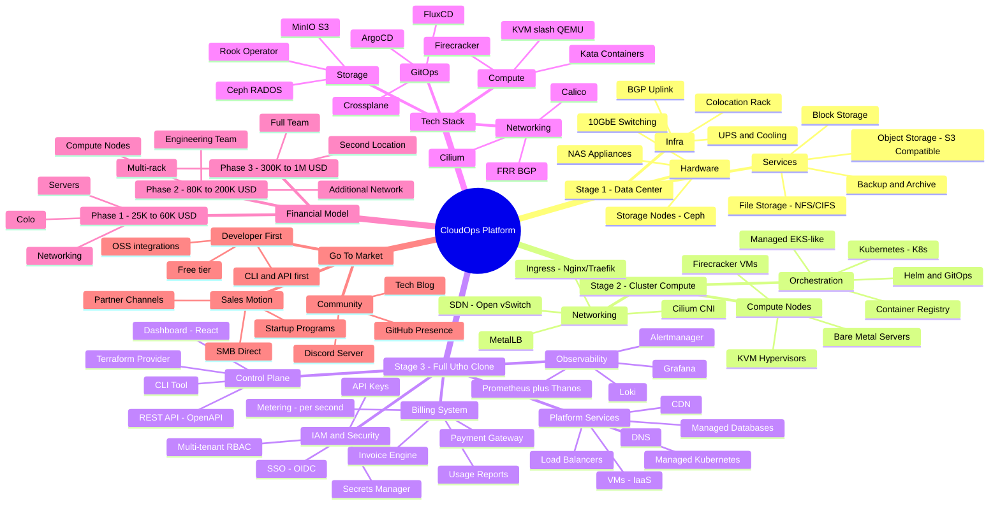

# Cloud Provider Business Roadmap
## From Zero → Data Center → Clusters → Utho-Like Platform

> **ONE-TIME PRODUCTION-READY INFRASTRUCTURE INVESTMENT FOCUS**
> Audience: Ambitious startup founder | Modern 2025+ tech | Real execution

---

## MASTER MINDMAP



---

## STAGE-BY-STAGE BREAKDOWN

```
┌─────────────────────────────────────────────────────────────────────────┐
│  STAGE 1           STAGE 2              STAGE 3                         │
│  ─────────         ─────────────        ──────────────────              │
│  Data Center   →   Cluster/Compute  →   Full Cloud Platform             │
│  (Months 1-6)      (Months 6-18)        (Months 18-36)                  │
│                                                                         │
│  • Storage         • VMs/Containers     • IaaS + PaaS                   │
│  • Backup          • Kubernetes         • Managed Services               │
│  • Object Store    • Bare Metal         • Multi-Region                   │
│  Revenue: $2K/mo   Revenue: $20K/mo     Revenue: $100K+/mo              │
└─────────────────────────────────────────────────────────────────────────┘
```

---

## 1. BUSINESS FOUNDATION

### What Type of Cloud Provider to Start

**Recommended: IaaS-first → PaaS-layer → SaaS tools**

| Phase | Type | Why |
|-------|------|-----|
| Phase 1 | Infrastructure-as-a-Service (IaaS) | Lowest complexity, easiest to monetize first |
| Phase 2 | IaaS + Container-as-a-Service (CaaS) | Kubernetes demand is exploding |
| Phase 3 | Full IaaS + PaaS + Developer Tools | Compete directly with Utho, DigitalOcean |

**DO NOT** start as PaaS — you need infrastructure ownership first.

### Initial Target Market (Rank by ROI)

```
Priority 1: Indian Startups & Scale-ups
  → Cost-sensitive, AWS/GCP is expensive, love Indian support
  → Compliance: data residency laws (India data in India)

Priority 2: DevOps Teams / Agencies
  → Need Kubernetes, CI/CD, staging environments
  → High technical literacy = self-serve = low support cost

Priority 3: Government / PSU (Long-term)
  → Sovereign cloud mandate in India
  → Data localization requirements

Priority 4: SMBs & E-commerce
  → Shared hosting graduates needing real cloud
  → Simple dashboards, affordable pricing
```

### Services by Phase

#### Phase 1 (Months 1-6): Storage-First MVP
- [ ] S3-compatible Object Storage (MinIO/Ceph)
- [ ] Block Storage volumes (Ceph RBD)
- [ ] Backup-as-a-Service (Velero + Ceph)
- [ ] Basic file storage (CephFS / NFS)
- [ ] Simple web dashboard (read-only metrics)
- [ ] REST API with API key auth

#### Phase 2 (Months 6-18): Compute + Clusters
- [ ] Virtual Machines (KVM-based)
- [ ] Managed Kubernetes (K3s/RKE2 as managed service)
- [ ] Container Registry (Harbor/Zot)
- [ ] Load Balancers (MetalLB + custom provisioner)
- [ ] Floating IPs / Elastic IPs
- [ ] Private Networking / VPC
- [ ] SSH Key Management
- [ ] Firewall Rules API

#### Phase 3 (Months 18-36): Platform Completeness
- [ ] Managed Databases (PostgreSQL, MySQL, Redis)
- [ ] CDN (Cloudflare-like with your edge nodes)
- [ ] DNS Management
- [ ] Serverless Functions (OpenFaaS/Knative)
- [ ] Marketplace (1-click apps: WordPress, Ghost, Supabase)
- [ ] Terraform Provider
- [ ] GitHub Actions Integration

---

## 2. WHERE AND HOW TO START

### Step-by-Step Zero to Launch Plan

```
WEEK 1-2: LEGAL & BUSINESS SETUP
├── Register company (Pvt Ltd India or LLC US)
├── Open business bank account
├── Get GSTIN (India) or EIN (USA)
├── Register domain + brand identity
└── Set up basic bookkeeping (Zoho Books / QuickBooks)

WEEK 3-4: COLOCATION SETUP
├── Find colo provider (STT-GDC, Nxtra, Ctrl S, CtrlS India)
├── Sign 1-year colo contract (1/4 to 1/2 rack)
├── Order networking equipment
├── Order first storage server batch (3 nodes minimum)
└── Set up out-of-band management (iDRAC/iLO)

MONTH 2: CORE STORAGE STACK
├── Bootstrap Ceph cluster (minimum 3 OSD nodes)
├── Deploy MinIO Gateway on top of Ceph
├── Configure S3-compatible API endpoint
├── Set up SSL/TLS (Let's Encrypt + Nginx)
├── Build basic admin portal (internal)
└── Deploy monitoring (Prometheus + Grafana)

MONTH 3: MVP API + DASHBOARD
├── Build REST API (Node.js/Go with OpenAPI spec)
├── Implement API key authentication
├── Build minimal customer dashboard (React)
├── Set up billing hooks (usage metering)
├── Stripe/Razorpay integration
└── Beta test with 5 internal users/friends

MONTH 4-5: CUSTOMER ONBOARDING
├── Launch private beta (waitlist)
├── Onboard 10 paying beta customers
├── Set up support (Discord + email ticketing)
├── Iterate on dashboard feedback
└── Add monitoring alerting for customers

MONTH 6: PUBLIC LAUNCH
├── Product Hunt launch
├── Blog post: "We built an Indian cloud storage platform"
├── Hacker News Show HN post
├── Activate referral program
└── 50+ customers target
```

### MVP Definition for a Cloud Provider

```
MINIMUM VIABLE CLOUD (MVC):
┌────────────────────────────────────────────────────┐
│  1. Object Storage (S3 API compatible)             │
│  2. Customer authentication + API keys             │
│  3. Simple dashboard: upload/download/manage       │
│  4. Usage metering + monthly invoice               │
│  5. Basic uptime SLA (99.9%)                       │
│  6. Support channel (Discord/email)                │
└────────────────────────────────────────────────────┘

NOT in MVP: VMs, Kubernetes, Load Balancers, DNS
These come in Phase 2 ONLY.
```

### What to Build First (Priority Order)

```
1. STORAGE (Week 1) → Easiest to monetize, low compute cost
2. NETWORKING (Week 3) → BGP + firewall, needed for everything  
3. COMPUTE (Month 4) → VMs on top of storage
4. PLATFORM TOOLS (Month 8+) → Kubernetes, DBs, etc.
```

---

## 3. INFRASTRUCTURE REQUIREMENTS

### Minimum Viable Infrastructure (Production-Grade)

#### Stage 1: Storage Cluster (One-Time Investment)

```
HARDWARE BOM — STAGE 1 (PRODUCTION STORAGE)
═══════════════════════════════════════════════════════════════

3x Storage Nodes (Ceph OSD Nodes):
  ├── CPU: AMD EPYC 7302 (16C/32T) or Intel Xeon Silver 4314
  ├── RAM: 128GB DDR4 ECC
  ├── OS SSD: 2x 480GB NVMe (RAID 1)
  ├── Storage: 6x 8TB Seagate Exos HDD + 1x 2TB NVMe (cache)
  ├── NIC: 2x 10GbE SFP+ (Mellanox/Intel X710)
  ├── Server: Dell PowerEdge R740 / SuperMicro 6029P-TRT
  └── Price per node: ~$6,000–10,000 USD

2x Monitor/Management Nodes (Ceph MON + MGR):
  ├── CPU: Intel Xeon E-2300 series
  ├── RAM: 64GB DDR4 ECC
  ├── Storage: 2x 480GB SSD (RAID 1)
  ├── NIC: 2x 1GbE + 1x 10GbE
  └── Price per node: ~$2,500–4,000 USD

Networking:
  ├── Core Switch: 48-port 10GbE (Mikrotik CRS354 or Ubiquiti ES-48-500W)
  ├── Firewall: Mikrotik CCR2004-1G-12S+2XS (10GbE routing)
  ├── Patch panels, cables, power strips: ~$1,000
  └── Networking total: ~$4,000–6,000 USD

Colocation (1/4 rack):
  ├── Space: 1/4 rack (10U)
  ├── Power: 2kW redundant
  ├── Bandwidth: 100Mbps unmetered or 10TB/month
  └── Cost: $300–600/month (Mumbai/Bangalore India colo)

STAGE 1 TOTAL ONE-TIME HARDWARE: $25,000–45,000 USD
STAGE 1 MONTHLY OPEX: $600–1,200 USD (colo + bandwidth)
═══════════════════════════════════════════════════════════════
```

#### Stage 2: Compute Cluster (One-Time Investment)

```
HARDWARE BOM — STAGE 2 (COMPUTE + K8S)
═══════════════════════════════════════════════════════════════

6x Compute Nodes (KVM Hypervisors):
  ├── CPU: AMD EPYC 7443 (24C/48T) — high core density for VMs
  ├── RAM: 256GB DDR4 ECC
  ├── OS: 2x 480GB NVMe (RAID 1)
  ├── Local SSD (ephemeral): 2x 2TB NVMe (VM root disks)
  ├── NIC: 2x 25GbE SFP28 (Mellanox ConnectX-4 Lx)
  ├── Server: Dell PowerEdge R650 / SuperMicro AS-2124BT
  └── Price per node: ~$8,000–14,000 USD

2x Control Plane Nodes (K8s Master + API):
  ├── CPU: Intel Xeon Silver 4314
  ├── RAM: 128GB DDR4 ECC
  ├── SSD: 4x 1TB NVMe
  ├── NIC: 2x 10GbE
  └── Price per node: ~$4,000–6,000 USD

Upgrade Networking for 25GbE:
  ├── Core Switch: Arista 7050CX3-32S or Mikrotik CRS510-8XS-2XQ
  ├── Top-of-rack switches (2x 48p 25GbE)
  └── Networking upgrade: ~$15,000–25,000 USD

Expand Colocation to 1/2 rack:
  ├── Additional 10U
  ├── 4kW power
  └── Additional: $400–800/month

STAGE 2 TOTAL ONE-TIME HARDWARE: $75,000–140,000 USD
STAGE 2 MONTHLY OPEX: $2,000–4,000 USD
═══════════════════════════════════════════════════════════════
```

#### Stage 3: Full Cloud (One-Time Investment)

```
HARDWARE BOM — STAGE 3 (FULL PLATFORM)
═══════════════════════════════════════════════════════════════

Scale to Full Rack + Second Location:
  ├── 20+ Compute nodes (mixing EPYC 9354P for newer gen)
  ├── 10+ Storage nodes (add NVMe-only tier for high-IOPS)
  ├── 4x Edge/CDN nodes (different cities)
  ├── Dedicated DB nodes (PostgreSQL clusters)
  ├── GPU nodes (1-2x for AI workloads - NVIDIA A100/H100)
  └── Estimated: $300,000–700,000 USD

GPU Nodes (Optional - High ROI):
  ├── Server: 4x NVIDIA A100 80GB SXM
  ├── CPU: AMD EPYC 7713 (64C)
  ├── RAM: 512GB
  └── Price: ~$80,000–120,000 per node

STAGE 3 TOTAL ONE-TIME: $300,000–1,000,000 USD
STAGE 3 MONTHLY OPEX: $10,000–25,000 USD
═══════════════════════════════════════════════════════════════

TOTAL 3-STAGE HARDWARE INVESTMENT ESTIMATE:
├── Bootstrapped (lean): $400,000–600,000 USD total
└── Funded (full scale): $1,000,000–2,000,000 USD total
```

### Colocation vs Own Hardware vs White-Label

| Option | Pros | Cons | Recommendation |
|--------|------|------|----------------|
| **Colocation** | Full control, own hardware, best margins at scale | Upfront CAPEX, operational complexity | ✅ **Best for Stage 1+2** |
| **Own Data Center** | Maximum control | $5M+ minimum, years to build | ❌ Too early |
| **White-label resell** | Fastest to launch | No margin, no differentiation | ⚠️ Only as financial bridge |
| **Hybrid** | Stage 1 colo + white-label overflow | Billing complexity | ✅ Smart for Stage 3 burst capacity |

**Recommendation**: Start with colocation (Ctrl S / STT-GDC / Nxtra India). Build on your own iron. Never start as a reseller — margins die.

---

## 4. TECH STACK (2025+ PRODUCTION GRADE)

### Compute Layer

```
COMPUTE STACK
═══════════════════════════════════════════════════════════════

Hypervisor:         KVM / QEMU (battle-tested, Linux-native)
VM Management:      libvirt + custom orchestrator
MicroVM:            Firecracker (for serverless/functions)
Secure Containers:  Kata Containers (VM-level isolation)
Orchestration:      Kubernetes (RKE2 or K3s for managed K8s)
Image Building:     Packer + custom base images
VM Templating:      Cloud-init for provisioning

Kubernetes Control Plane (for managed K8s offering):
  ├── RKE2 (Rancher Kubernetes Engine 2) — production grade
  ├── Cluster API (CAPI) — declarative K8s lifecycle
  ├── Fleet (Rancher) — multi-cluster management
  └── Kube-VIP — control plane HA

Container Runtime:  containerd + runc
Image Registry:     Harbor (enterprise features, free OSS)
```

### Storage Layer

```
STORAGE STACK
═══════════════════════════════════════════════════════════════

Primary Storage:    Ceph (RADOS) — the gold standard
  ├── Object:       Ceph RGW (RadosGateway) — S3/Swift API
  ├── Block:        Ceph RBD — for VM disks
  └── File:         CephFS — for shared file storage

S3 Gateway:         MinIO (for simpler deployments or edge)
K8s Storage:        Rook-Ceph operator (Kubernetes-native Ceph)
Backup:             Velero (K8s) + custom agent for VMs
Data Tiering:
  ├── Hot Tier:     NVMe SSDs (Ceph NVMe OSD)
  ├── Warm Tier:    SATA SSD
  └── Cold Tier:    HDD (bulk/archive)

Monitoring:         Ceph Dashboard + Prometheus exporter
```

### Networking Layer

```
NETWORKING STACK
═══════════════════════════════════════════════════════════════

Physical:           10/25GbE switching (Mikrotik / Arista)
Routing:            FRRouting (FRR) — BGP, OSPF
Firewall:           nftables + custom API wrapper
SDN:                Open vSwitch (OVS) for VM networking

Kubernetes CNI:     Cilium (eBPF-based, best performance + security)
  ├── Network Policy: Cilium NetworkPolicy
  ├── Service Mesh:   Cilium Service Mesh (no sidecar)
  └── Observability:  Hubble (Cilium's observability)

Load Balancing:
  ├── Internal:     MetalLB (BGP mode) — bare metal LB
  ├── External:     HAProxy + Keepalived
  └── Ingress:      Nginx Ingress Controller / Traefik

DNS:                CoreDNS (internal) + PowerDNS (customer-facing)
BGP Peering:        FRR + Bird2 for upstream peering
DDoS Protection:    Corero / Netscout or upstream scrubbing center
VPN:                WireGuard (customer VPC tunnels)
```

### Control Plane Architecture

```
CONTROL PLANE
═══════════════════════════════════════════════════════════════

API Layer:
  ├── Language:     Go (performance + concurrency) or Node.js/TypeScript
  ├── Framework:    Gin (Go) or Fastify (Node.js)
  ├── API Spec:     OpenAPI 3.0
  ├── Auth:         JWT + API Keys (Ed25519 signed)
  └── Rate Limiting: Redis-based token bucket

Message Queue:      NATS JetStream (fast, lightweight) or RabbitMQ
Task Orchestrator:  Temporal.io (workflow engine for long-running ops)
Database:           PostgreSQL 16 (primary) + Redis (cache/sessions)
Config Store:       etcd (distributed config)
Secrets:            HashiCorp Vault (open source)
Service Discovery:  Consul

Event Bus:          Apache Kafka (for high-volume metering events)

Dashboard:
  ├── Framework:    React + Vite + TailwindCSS
  ├── State:        Zustand + React Query (TanStack Query)
  ├── Charts:       Recharts / Tremor
  └── UI Kit:       shadcn/ui

CLI Tool:
  ├── Language:     Go (single binary, cross-platform)
  └── Example:      cloudops vm create --name web-01 --size 2c-4g
```

### Observability Stack

```
OBSERVABILITY
═══════════════════════════════════════════════════════════════

Metrics:
  ├── Collection:   Prometheus + Node Exporter + cAdvisor
  ├── Long-term:    Thanos (multi-cluster, long-term retention)
  └── Dashboards:   Grafana (dashboards + alerting)

Logs:
  ├── Collection:   Promtail / Fluentbit → Loki
  ├── Storage:      Grafana Loki
  └── Query:        LogQL

Traces:
  ├── Instrumentation: OpenTelemetry SDK
  ├── Backend:      Grafana Tempo
  └── UI:           Grafana (trace view)

Alerting:
  ├── Rules:        Prometheus AlertManager
  ├── Routing:      PagerDuty / OpsGenie
  └── Customer:     Custom webhook alerts to their endpoints

Uptime Monitoring:  Uptime Robot + internal probes
Status Page:        Cachet (self-hosted) or Betteruptime
```

### Security Architecture

```
SECURITY STACK
═══════════════════════════════════════════════════════════════

IAM:
  ├── Internal:     Keycloak (OIDC/SSO for team + admin)
  ├── Customer-facing: Custom RBAC built into API
  ├── API Auth:     Ed25519 API keys + JWT tokens
  └── MFA:          TOTP (Google Authenticator compatible)

Network Security:
  ├── VM Isolation:  Private VLANs per customer
  ├── K8s:          Cilium NetworkPolicy + PodSecurityAdmission
  ├── Firewall API: nftables rules via custom operator
  └── TLS:          Cert-manager + Let's Encrypt / internal CA

Secrets Management:
  ├── Engine:       HashiCorp Vault
  ├── K8s:          External Secrets Operator
  └── Rotation:     Automated rotation policies

Vulnerability:
  ├── Container Scan: Trivy (images) + Grype
  ├── IaC Scan:     Checkov / Terrascan
  └── CVE Monitoring: OWASP Dependency-Check

Compliance:
  ├── Audit Logging: All API calls logged + immutable
  ├── GDPR/Data:    Encryption at rest (Ceph encryption + LUKS)
  └── Certs:        ISO 27001 (Stage 3 target)
```

### Billing & Metering System

```
BILLING STACK
═══════════════════════════════════════════════════════════════

Metering Engine (Build Custom):
  ├── Event Source:   cAdvisor + Prometheus metrics
  ├── Event Stream:   Apache Kafka (high-volume usage events)
  ├── Aggregator:     Custom Go service (per-second → hourly → monthly)
  └── Storage:        TimescaleDB (time-series for usage data)

Billing Engine:
  ├── OSS Option:     OpenMeter.io (modern, open-source metering)
  ├── Invoicing:      Custom + PDF generation (Puppeteer/WeasyPrint)
  └── Taxation:       GST calculation (India) / automated tax

Payment Processing:
  ├── India:          Razorpay (best for India, auto-GST)
  ├── Global:         Stripe
  └── Prepaid:        Credit wallet model (like AWS Credits)

Pricing Models:
  ├── Pay-as-you-go:  Per-hour VM billing
  ├── Reserved:        1-year commit = 30-40% discount
  ├── Spot/Preemptible: 60-80% discount (interruptible)
  └── Bandwidth:       First 1TB free, then per-GB
```

---

## 5. COSTING & FINANCIAL MODEL

### One-Time Hardware Investment Summary

```
CAPEX BREAKDOWN (PRODUCTION-READY)
═══════════════════════════════════════════════════════════════

STAGE 1 — Storage Platform (Month 1-6):
  Hardware:       $25,000 – $45,000
  Networking:     $4,000  – $6,000
  Cabling/Misc:   $1,000  – $2,000
  ─────────────────────────────────
  STAGE 1 TOTAL:  $30,000 – $53,000 USD

STAGE 2 — Compute Platform (Month 6-18):
  Compute servers:  $50,000 – $85,000
  Network upgrade:  $15,000 – $25,000
  Additional colo:  $3,000  – $5,000 (prepaid 6mo)
  ─────────────────────────────────────
  STAGE 2 TOTAL:    $68,000 – $115,000 USD

STAGE 3 — Full Platform (Month 18-36):
  Scale-out servers:  $150,000 – $400,000
  Second colo site:   $20,000  – $40,000
  GPU nodes (1-2):    $80,000  – $200,000
  ───────────────────────────────────────
  STAGE 3 TOTAL:      $250,000 – $640,000 USD

══════════════════════════════════════════
TOTAL 3-STAGE CAPEX:  $350,000 – $800,000
══════════════════════════════════════════
Note: GPU nodes are optional. Without GPUs:
Total: $270,000 – $600,000 USD
```

### Monthly Operating Costs (OPEX)

```
MONTHLY OPEX BY STAGE
═══════════════════════════════════════════════════════════════

STAGE 1 (Month 1-6):
  Colocation (1/4 rack):  $400/month
  Bandwidth (100Mbps):    $200/month
  Cloud tooling (SaaS):   $200/month
  ────────────────────────────────────
  OPEX:                   ~$800/month

STAGE 2 (Month 6-18):
  Colocation (1/2 rack):  $800/month
  Bandwidth (500Mbps):    $500/month
  Staff (2 engineers):    $5,000–8,000/month (India rates)
  SaaS tools:             $500/month
  ─────────────────────────────────────
  OPEX:                   ~$7,000–10,000/month

STAGE 3 (Month 18-36):
  Colocation (2 racks):   $3,000/month
  Bandwidth (5Gbps):      $2,000/month
  Staff (8 people):       $25,000–40,000/month
  Marketing/Sales:        $5,000/month
  SaaS + tools:           $2,000/month
  ─────────────────────────────────────
  OPEX:                   ~$37,000–52,000/month
```

### Revenue Projections & Unit Economics

```
UNIT ECONOMICS
═══════════════════════════════════════════════════════════════

Object Storage (1TB/month):
  Cost to serve:  $0.004/GB/month  (~hardware amortized 5yr)
  Selling price:  $0.018/GB/month  (vs S3 $0.023/GB)
  Margin:         77% gross margin

VM (2vCPU, 4GB RAM):
  Cost to serve:  $3.50/month    (hardware + power amortized)
  Selling price:  $12/month      (vs DO: $18, Linode: $12)
  Margin:         70% gross margin

Managed Kubernetes (3 nodes):
  Cost to serve:  $25/month
  Selling price:  $75/month
  Margin:         67% gross margin

CUSTOMER TIER EXAMPLES:
  Small startup:    50GB storage + 2 VMs = ~$35/month
  Mid startup:      500GB + 5 VMs + 1 K8s = ~$200/month
  Scale-up:         5TB + 20 VMs + 3 K8s = ~$2,000/month
```

### Break-Even Analysis

```
BREAK-EVEN TARGET
═══════════════════════════════════════════════════════════════

Stage 1 Break-even (at $800/month OPEX):
  Need: ~50 customers at $16 avg monthly = $800/month
  Realistic: 20 customers at $40 avg = break-even

Stage 2 Break-even (at $10,000/month OPEX):
  Need: ~100 customers at $100 avg
  Realistic: 60 customers at $170 avg = break-even

Stage 3 Break-even (at $50,000/month OPEX):
  Need: ~500 customers at $100 avg
  Or: 100 customers at $500 avg (more realistic)
```

### Pricing Strategy

```
PRICING vs COMPETITORS
═══════════════════════════════════════════════════════════════

SERVICE          | YOU        | Utho       | DigitalOcean | AWS
─────────────────────────────────────────────────────────────────
Object Storage   | $0.018/GB  | $0.020/GB  | $0.023/GB    | $0.023/GB
Block Storage    | $0.08/GB   | $0.10/GB   | $0.10/GB     | $0.10/GB
2CPU/4GB VM      | $10/mo     | $12/mo     | $18/mo       | $34/mo
4CPU/8GB VM      | $18/mo     | $22/mo     | $36/mo       | $68/mo
Managed K8s      | $75/mo     | $80/mo     | $12+$72/mo   | $144/mo

STRATEGY: Be 20-30% cheaper than Utho on compute.
Be price-competitive with DO on managed services.
Offer BETTER support (phone/WhatsApp for India).
```

---

## 6. GO-TO-MARKET STRATEGY

### Getting First 100 Customers

```
CUSTOMER ACQUISITION FUNNEL
═══════════════════════════════════════════════════════════════

MONTH 1-2: FOUNDATION (0 → 10 customers)
  ├── Friends & Network: 5 customers (free for now)
  ├── Tech communities: Post in IndieHackers, HN, r/selfhosted
  ├── WhatsApp/Telegram startup groups (India specific)
  └── Personal LinkedIn posts (founder brand building)

MONTH 3-4: EARLY ADOPTERS (10 → 40 customers)
  ├── Product Hunt launch
  ├── "Migration from AWS" case study  
  ├── Offer $50 credit for first 100 signups
  ├── Partner with 1-2 Indian startup accelerators (YC India, 100X)
  └── Launch Discord server for community

MONTH 5-6: GROWTH LOOP (40 → 100 customers)
  ├── Referral program: 20% recurring commission
  ├── Blog SEO: "Cheap Kubernetes India", "S3 alternative India"
  ├── YouTube: "Deploy K8s in 5 minutes on CloudOps"
  ├── Dev tools integration: VS Code extension, GitHub Action
  └── Conference: Attend/sponsor KubeCon India, DevOps events
```

### Developer-First Growth Strategy

```
DEVELOPER ADOPTION FLYWHEEL
═══════════════════════════════════════════════════════════════

1. CLI FIRST → Always ship CLI alongside API
   cloudops vm create, cloudops storage ls, cloudops k8s create

2. API QUALITY → OpenAPI spec, SDKs (Python, Go, JS, PHP)

3. TERRAFORM PROVIDER → Required for DevOps teams
   resource "cloudops_vm" "web" { ... }

4. GITHUB ACTIONS → Native CI/CD integration
   - uses: cloudops/deploy-action@v1

5. DOCUMENTATION → world-class docs (like Stripe/Vercel quality)
   → Interactive API explorer
   → Working code examples in 5 languages

6. OPEN SOURCE → Open source non-core tools
   → Terraform provider (open source)
   → CLI tool (open source)
   → Status page (open source)
   → Monitoring dashboards (Grafana dashboard IDs public)
```

### Community Building

```
COMMUNITY STRATEGY
═══════════════════════════════════════════════════════════════

Discord Server:
  ├── #announcements (product updates)
  ├── #general (community chat)
  ├── #help-and-support (async support)
  ├── #showcase (customer projects)
  └── #feedback (product feedback)

Content Marketing:
  ├── Weekly technical blog posts
  ├── "How we built X" engineering blog
  ├── Monthly infrastructure cost breakdowns
  └── Open startup metrics (MRR, customers - builds trust)

YouTube Channel:
  ├── Setup tutorials (K8s, storage, VMs)
  ├── Cost comparison videos (You vs AWS)
  ├── Architecture deep dives
  └── Customer success stories
```

---

## 7. UNIQUE SELLING PROPOSITIONS (USP)

### What You Can Do Better Than AWS

```
USP FRAMEWORK
═══════════════════════════════════════════════════════════════

1. INDIA-FIRST (vs global players)
   ├── Data sovereignty: "Your data never leaves India"
   ├── GST-compliant invoicing out of the box
   ├── INR pricing (no forex fluctuation headache)
   ├── Phone/WhatsApp support in Hindi/English
   └── Latency: <10ms within India vs 60-200ms to foreign DCs

2. SIMPLICITY (vs complex AWS console)
   ├── Deploy Kubernetes in 3 clicks, not 30
   ├── No surprise billing (hard caps + alerts)
   ├── Single unified dashboard (not 200+ services)
   └── Beginner-friendly with docs for non-AWS experts

3. COST TRANSPARENCY (vs AWS's 700+ pricing pages)
   ├── Simple, predictable pricing
   ├── No data egress surprises (1TB free egress/month)
   ├── Cost calculator that actually works
   └── Budget alerts that hard-stop (not soft limits)

4. DEVELOPER EXPERIENCE
   ├── Terraform provider maintained by real engineers
   ├── API response times <50ms
   ├── CLI that works offline (local state cache)
   └── Status page with real-time incident communication

5. PERFORMANCE/PRICE
   ├── AMD EPYC CPUs (50% better price/performance than Intel)
   ├── NVMe storage default (not HDD upcharges like AWS)
   └── Free private networking (AWS charges for VPC data)
```

### Real Successful Niche Cloud Providers (Proof It Works)

| Company | Niche | Result |
|---------|-------|--------|
| **Hetzner** | Affordable EU cloud | €1.5B+ valuation, 400K+ customers |
| **Vultr** | Global compute, dev-focused | $3.5B valuation |
| **UTHO (Hostbill)** | India IaaS | Growing Indian market leader |
| **Fly.io** | Run apps close to users | $70M+ raised, loved by developers |
| **Railway** | Simplest cloud deployment | Profitable, 200K+ developers |
| **Civo** | Kubernetes-first cloud | Acquired by Kubefirst ecosystem |
| **OVHcloud** | EU sovereignty + cost | €800M+ revenue |

---

## 8. SCALING STRATEGY

### User Growth Phases

```
SCALING BLUEPRINT
═══════════════════════════════════════════════════════════════

PHASE: 0 → 10 users (Months 1-3)
  Focus: Manual operations OK, learn customer needs
  Infra: Single storage cluster + colo
  Team: Founder(s) only
  Revenue: $0 – $1,000/month
  Action: Handhold every customer, collect feedback

PHASE: 10 → 100 users (Months 3-9)  
  Focus: Automate provisioning API
  Infra: Add compute cluster (Stage 2 hardware)
  Team: +1 engineer, +1 support
  Revenue: $1,000 – $15,000/month
  Action: Launch public beta, referral program

PHASE: 100 → 1,000 users (Months 9-18)
  Focus: Self-service everything, reliability
  Infra: Scale storage + compute, add LBs + K8s
  Team: +2 engineers, +1 sales, +1 DevRel
  Revenue: $15,000 – $150,000/month
  Action: Startup program, accelerator partnerships

PHASE: 1,000 → 10,000 users (Months 18-36)
  Focus: Multi-region, enterprise features
  Infra: Second colo site (Delhi + Mumbai)
  Team: 15-25 people total  
  Revenue: $150,000 – $1,500,000/month
  Action: Enterprise sales, ISO 27001, SLA contracts

PHASE: 10,000 → 100,000 users (Years 3-5)
  Focus: International expansion (SEA, Middle East)
  Infra: 5+ regions, 100+ racks
  Team: 50-100 people
  Revenue: $1.5M – $15M/month
  Action: Series A funding, enterprise market
```

### Multi-Region Expansion Strategy

```
REGION ROLLOUT (INDIA FIRST, THEN SEA)
═══════════════════════════════════════════════════════════════

Year 1:   Mumbai (Primary) - largest startup hub
Year 1.5: Bangalore (Secondary) - tech corridor, latency
Year 2:   Delhi/NCR (Government + Enterprise)
Year 2.5: Singapore (SEA expansion + international)
Year 3:   Dubai (Middle East + NRI market)
Year 4:   Frankfurt (EU data sovereignty customers)

Region launch checklist:
  ├── Colo contract signed + hardware shipped
  ├── BGP peering with local IXP
  ├── Ceph cluster bootstrapped (separate failure domain)
  ├── K8s cluster registered via Cluster API
  ├── DNS region selector (latency-based routing)
  └── Monitoring dashboards for region health
```

### Automation & Self-Healing

```
AUTOMATION TARGETS (BY PRIORITY)
═══════════════════════════════════════════════════════════════

Day 1:   Customer VM provisioning (automated via API)
Week 1:  Storage bucket creation (automated)
Month 1: Auto-scaling storage (Ceph auto-OSD rebalancing)
Month 2: Failed VM auto-restart (libvirt health checks)
Month 3: Node failure → VM migration (live migration + fencing)
Month 4: Auto certificate renewal (cert-manager)
Month 6: Auto customer K8s cluster recovery (CAPI remediation)
Month 9: Predictive scaling (ML-based capacity planning)
Year 2:  Full GitOps infra (any change = PR → auto-apply)

Tools for self-healing:
  ├── Kubernetes:  Self-healing via controllers natively
  ├── VMs:         custom health daemon + libvirt watchdog
  ├── Storage:     Ceph self-heals (re-replication on OSD failure)
  └── Network:     BFD (Bidirectional Forwarding Detection) for BGP
```

---

## 9. RISKS & REALITY CHECK

### Biggest Challenges

```
RISK MATRIX
═══════════════════════════════════════════════════════════════

TECHNICAL RISKS:
┌────────────────────────────────────────────────────────────┐
│ Risk                  │ Severity │ Mitigation              │
│───────────────────────┼──────────┼─────────────────────────│
│ Ceph data corruption  │ CRITICAL │ 3x replication minimum  │
│ Node failure cascade  │ HIGH     │ N+1 redundancy always   │
│ Network partition     │ HIGH     │ BFD + redundant uplinks │
│ DDoS attack           │ HIGH     │ Upstream scrubbing + ACL│
│ Security breach       │ CRITICAL │ Regular pen testing     │
│ Colo power outage     │ MEDIUM   │ UPS + generator SLA     │
└────────────────────────────────────────────────────────────┘

BUSINESS RISKS:
┌────────────────────────────────────────────────────────────┐
│ Risk                  │ Severity │ Mitigation              │
│───────────────────────┼──────────┼─────────────────────────│
│ AWS price war         │ HIGH     │ Focus on niche + support│
│ Customer churn        │ HIGH     │ Lock-in via managed svc │
│ Cash flow (CAPEX)     │ HIGH     │ Revenue before Stage 2  │
│ Key employee loss     │ MEDIUM   │ Documentation + backups │
│ Regulatory            │ MEDIUM   │ India IT Act compliance │
│ Competitor (Utho)     │ MEDIUM   │ USP differentiation     │
└────────────────────────────────────────────────────────────┘
```

### What Usually Fails in Cloud Startups

```
FAILURE MODES (LEARN FROM OTHERS)
═══════════════════════════════════════════════════════════════

1. BUILDING BEFORE SELLING
   ❌ Spent 18 months building perfect infra, got 0 customers
   ✅ Fix: Get 10 paying customers on Stage 1 before Stage 2 starts

2. COMPETING ON FEATURES WITH AWS
   ❌ Tried to build 200 services like AWS from day 1
   ✅ Fix: Be excellent at 5 things, not mediocre at 50

3. UNDERPRICING WITHOUT MARGIN
   ❌ Priced at cost to acquire customers, never profitable
   ✅ Fix: Always maintain 60%+ gross margin minimum

4. SINGLE POINT OF FAILURE EVERYWHERE
   ❌ One node fails, entire platform down, customers leave
   ✅ Fix: N+1 redundancy from day 1, even in Stage 1

5. IGNORING SUPPORT QUALITY
   ❌ Slow/no support → customers move to DigitalOcean
   ✅ Fix: Response time < 4 hours, < 1 hour for P1 incidents

6. NO DOCUMENTATION
   ❌ Engineers are the documentation, bus factor = 1
   ✅ Fix: Runbooks, architecture docs from week 1

7. PREMATURE MULTI-REGION
   ❌ Built 3 regions before mastering 1, wasted capital
   ✅ Fix: Master 1 region, get to 1000 customers, then expand

8. IGNORING COMPLIANCE EARLY
   ❌ Got enterprise client, failed security audit, lost deal
   ✅ Fix: SOC 2 / ISO 27001 roadmap from Stage 2
```

---

## 10. EXECUTION ROADMAP

### 30-Day Sprint Plan

```
30-DAY EXECUTION PLAN
═══════════════════════════════════════════════════════════════

WEEK 1: LEGAL + PROCUREMENT
  Day 1:  Register company (Pvt Ltd)
  Day 2:  Open business bank account
  Day 3:  Contact 3 colo providers (STT-GDC, Ctrl S, Nxtra)
  Day 4:  Request quotes for hardware (Dell, SuperMicro, local)
  Day 5:  Finalize brand name + domain
  Day 6:  Set up GitHub org + project management (Linear)
  Day 7:  Document infrastructure architecture

WEEK 2: CONTRACTS + DESIGN
  Day 8:  Sign colo contract
  Day 9:  Place hardware order
  Day 10: Design Ceph network topology (draw it out)
  Day 11: Set up dev environment (Proxmox or KVM on dev machine)
  Day 12: Bootstrap Ceph in lab (3 VMs on laptop/dev server)
  Day 13: Test MinIO S3 compatibility against aws-cli
  Day 14: Start control plane API skeleton (Go or Node.js)

WEEK 3: BUILD CORE API
  Day 15: Hardware delivered to colo (hopefully)
  Day 16: Rack and cable servers
  Day 17: OS install (Ubuntu 22.04 LTS / Rocky Linux 9)
  Day 18: Bootstrap production Ceph cluster
  Day 19: Deploy MinIO gateway + test S3 API
  Day 20: API: customer auth + API key issuance
  Day 21: API: storage bucket CRUD endpoints

WEEK 4: DASHBOARD + BETA
  Day 22: Basic React dashboard (login, storage management)
  Day 23: Razorpay/Stripe payment integration
  Day 24: Usage metering (basic counter per customer)
  Day 25: Deploy Prometheus + Grafana for monitoring
  Day 26: Set up status page (Cachet)
  Day 27: Invite 5 beta customers
  Day 28: Fix bugs from beta feedback
  Day 29: Document onboarding guide
  Day 30: Review metrics, plan next 60 days
```

### 90-Day Milestone Plan

```
90-DAY MILESTONES
═══════════════════════════════════════════════════════════════

BY DAY 30:
  ✅ Storage MVP live in colo
  ✅ 5 beta customers onboarded
  ✅ Basic dashboard functional
  ✅ Razorpay billing working
  ✅ Monitoring stack deployed

BY DAY 60:
  ✅ 25 paying customers
  ✅ $2,500+/month MRR
  ✅ API v1 complete (object storage, auth, billing)
  ✅ CLI tool released (v0.1.0)
  ✅ Block storage (Ceph RBD) API ready
  ✅ Product Hunt launch
  ✅ Discord community (50+ members)

BY DAY 90:
  ✅ 50 paying customers
  ✅ $7,000+/month MRR
  ✅ VM provisioning API (KVM) — even if manual first
  ✅ Documentation site live (Docusaurus/Nextra)
  ✅ Referral program live
  ✅ First case study published
  ✅ Hardware order for Stage 2 compute nodes placed
```

### 1-Year Roadmap

```
12-MONTH ROADMAP
═══════════════════════════════════════════════════════════════

Q1 (Month 1-3): MVP LAUNCH
  Goal:     Storage platform live, 50 customers, $5K MRR
  Milestone: Break even on Stage 1 hardware
  Team:     Founder + 1 part-time engineer
  Funding:  Bootstrapped / personal savings

Q2 (Month 4-6): COMPUTE EXPANSION
  Goal:     VMs live, 150 customers, $20K MRR
  Milestone: Stage 2 hardware fully operational
  Team:     +1 full-time engineer, +1 support
  Funding:  Revenue-funded or seed round ($100K)

Q3 (Month 7-9): KUBERNETES PLATFORM
  Goal:     Managed K8s live, 300 customers, $50K MRR
  Milestone: First enterprise customer signed
  Team:     5 people total
  Funding:  Revenue or Pre-seed ($200K)

Q4 (Month 10-12): PLATFORM MATURITY
  Goal:     Full IaaS platform, 500+ customers, $100K MRR
  Milestone: Second colo site contracted
  Team:     8-10 people
  Funding:  Seed round ($500K–1M)
  Launch:   Managed DBs, LBs, CDN (beta)
  Awards:   Apply for NASSCOM, Startup India recognition

═══════════════════════════════════════════════════════════════
END OF YEAR 1 TARGETS:
  Customers:   500+
  MRR:         $100,000+
  ARR:         $1,200,000
  Team:        10 people
  Regions:     1 (Mumbai primary)
  Infrastructure: 2 racks, 30+ servers
  Gross Margin: 65%+
═══════════════════════════════════════════════════════════════
```

---

## APPENDIX: TECHNOLOGY VENDOR QUICK REFERENCE

### Recommended Colocation Providers (India)

| Provider | Location | Tier | Contact |
|----------|----------|------|---------|
| STT-GDC India | Mumbai, Chennai, Bangalore | Tier III+ | sttgdc.com |
| Nxtra (Airtel) | Pan-India | Tier III | nxtra.in |
| Ctrl S | Hyderabad, Mumbai | Tier IV | ctrls.in |
| GPX India | Mumbai | Tier III+ | gpxglobal.net |
| NetMagic (NTT) | Mumbai, Bangalore | Tier III | netmagicsolutions.com |

### Hardware Vendors to Contact for Quotes

```
Servers (New):
  ├── Dell Technologies India: dell.com/en-in/business
  ├── SuperMicro India: supermicro.com
  └── HPE India: hpe.com/in/en

Servers (Refurbished - 40-60% cheaper):
  ├── ServerMonkey (US, ships India)
  ├── Bargain Hardware (UK)
  └── Local resellers on IndiaMART (Dell/HP refurb)

Networking:
  ├── Mikrotik (budget, great performance): mikrotik.com
  ├── Arista (enterprise): arista.com
  └── Ubiquiti (prosumer): ui.com
```

### Key Open Source Projects to Study

```
ESSENTIAL OSS PROJECTS
═══════════════════════════════════════════════════════════════
Ceph          → ceph.io                  (storage backbone)
Rook          → rook.io                  (Ceph on K8s)
MinIO         → min.io                   (S3 compatible)
RKE2          → docs.rke2.io             (K8s distribution)
Cluster API   → cluster-api.sigs.k8s.io  (K8s lifecycle)
Cilium        → cilium.io                (networking + security)
MetalLB       → metallb.universe.tf      (bare metal LB)
FRRouting     → frrouting.org            (BGP/routing)
Temporal      → temporal.io              (workflow orchestration)
Vault         → vaultproject.io          (secrets management)
OpenMeter     → openmeter.io             (usage metering)
Keycloak      → keycloak.org             (IAM/SSO)
Harbor        → goharbor.io              (container registry)
Thanos        → thanos.io                (long-term Prometheus)
Grafana Stack → grafana.com              (observability)
```

---

## SUMMARY DASHBOARD

```
┌─────────────────────────────────────────────────────────────────────────┐
│              CLOUD PROVIDER BUSINESS AT A GLANCE                        │
├─────────────────────┬───────────────────┬───────────────────────────────┤
│  STAGE 1            │  STAGE 2          │  STAGE 3                      │
│  Data Center        │  Compute/K8s      │  Full Platform                │
├─────────────────────┼───────────────────┼───────────────────────────────┤
│  Timeline: M1-6     │  Timeline: M6-18  │  Timeline: M18-36             │
│  CAPEX: $30-53K     │  CAPEX: $68-115K  │  CAPEX: $250-640K             │
│  OPEX: $800/mo      │  OPEX: $10K/mo    │  OPEX: $50K/mo                │
│  Revenue: $5K/mo    │  Revenue: $50K/mo │  Revenue: $200K+/mo           │
│  Team: 1-2          │  Team: 3-5        │  Team: 10-25                  │
├─────────────────────┼───────────────────┼───────────────────────────────┤
│  Services:          │  Services:        │  Services:                    │
│  • Object Storage   │  • VMs (KVM)      │  • Full IaaS                  │
│  • Block Storage    │  • Managed K8s    │  • Managed DBs                │
│  • Backup           │  • Container Reg  │  • CDN                        │
│  • File Storage     │  • Load Balancers │  • DNS                        │
│                     │  • Floating IPs   │  • Serverless                 │
│                     │  • Private Net    │  • GPU Cloud                  │
├─────────────────────┼───────────────────┼───────────────────────────────┤
│  Stack:             │  Stack:           │  Stack:                       │
│  Ceph + MinIO       │  + KVM + RKE2     │  + Managed PaaS               │
│  Prometheus+Grafana │  + Cilium + FRR   │  + CDN + Serverless           │
│  Nginx + Vault      │  + MetalLB        │  + Multi-region               │
└─────────────────────┴───────────────────┴───────────────────────────────┘

TOTAL 3-YEAR INVESTMENT:  ~$400K–800K one-time CAPEX
TARGET ARR BY YEAR 3:     $5M–15M
GROSS MARGIN TARGET:      65%+
```

---

*Last Updated: April 2026 | For: CloudOps Platform Startup*
*Tech Stack: 2025+ Production Grade | Focus: India-first, then SEA*
